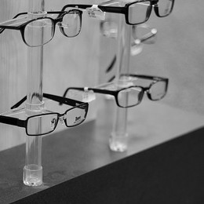

[Dr. Ross](https://www.yelp.com/biz/edward-ross-od-pittsburgh-3) and his staff
are awesome and let me tell you why.

He's a very practical guy. He'll get the job done quickly and efficiently.
And, he'll answer any and all questions. Something that not all doctors do
well. His staff is awesome and helpful as well.

<!-- more -->

I've been getting glasses from him for a while and the assistant mentioned
daily wear contacts. So I made an appointment to try them out (when I last
wore contacts, daily wear contacts had just come out and cost a fortune, now
they are pretty darn cheap!).

I wore them, but I had some of the eye-drying problems I had before at work
(I'm a software engineer...I stare at a screen all day). So I borrowed a
friends "computer glasses" (yellow tinted, with a +0.25 magnification) and
they helped. Dr. Ross measured the magnification, since the glasses didn't say
what their magnification was.

Being scientific minded, I wanted to see if unmagnified, untinted glasses were
just as good. Dr. Ross let me borrow a pair of display glasses (the demo
glasses they use for showing off the frames) which had no magnification or
tint. As it turns out, they did cut down on the dryness. Interesting!

In addition, he let me try a variety of contacts brands to see if some work
better for me than others. When I last tried getting contacts, the eye doctor
I had just sold me a box (no trials) and that was that. No different brands.
No samples.

Any eye doctor can do the job, I'm sure, but Dr. Ross does it well!

Just as an extra: They had an old set of sample tints. They let me go through
them for a while. It was trippy. Very late 70s.

Ciao!
